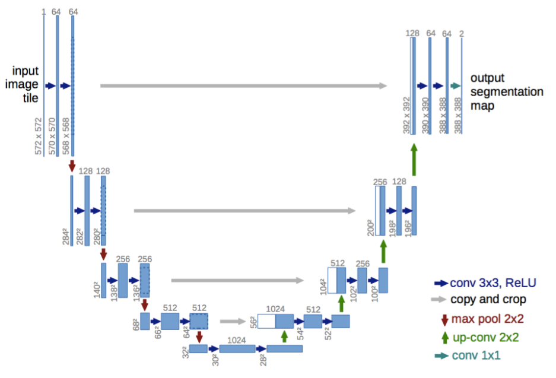
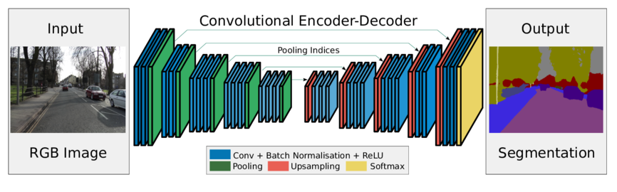
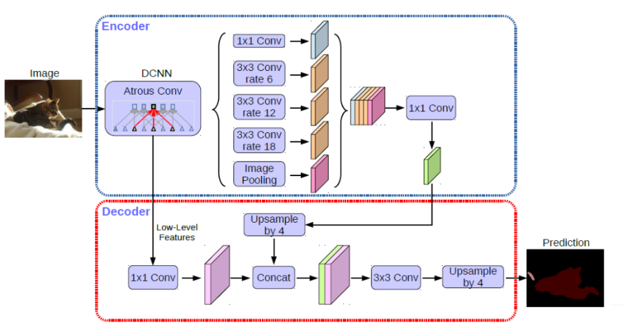
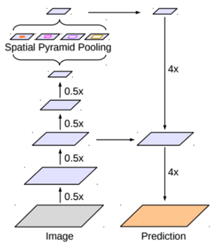

# Semantic Segmentation
Semantic segmentation is a computer vision technique that enables computers to discern one region in an image from another, based on the semantic context of that region. Semantic segmentation has many applications in diverse fields like medicine, Autonomous driving., and agriculture.
# Dataset
The dataset used for Semantic Segmentation is  Monuseg dataset which contains multi organ tissue images with the ground truth segmentation masks. The dataset used for training the and testing the model can be downloaded from this [link](https://drive.google.com/open?id=1LEn2IXZkxLPRUd2ydbL_ZvXR5Yw5PE64). of google drive and information about dataset is available on this [link](https://monuseg.grand-challenge.org/Data/).

# Models
The following three models have been trained.  
# 1.UNET

# 2.SEGNET

# 3.Deep Lab V3 Plus

# Quantitative Results
The results are shown below
   # Training
| Model | Loss | Accuracy | F1 Score | Dice Score |
| ----- | ---- | ---- | ---- | ---- |
| UNET | 0.0869 | 0.9633 | 0.9328 | 0.9848 
| SEGNET | 0.2399 | 0.8965 | 0.8085 | 0.9572 
| DeepLabV3Plus | 0.0455 | 0.9806 | 0.9645 | 0.9919
  # Validation
| Model | Loss | Accuracy | F1 Score | Dice Score |
| ----- | ---- | ---- | ---- | ---- |
| UNET | 0.1100 | 0.9555 | 0.9216 | 0.9809 
| SEGNET | 0.2431 | 0.8946 | 0.8090 | 0.9560 
| DeepLabV3Plus | 0.1035 | 0.9635 | 0.9347 | 0.9847

 # Testing 
| Model | Loss | Accuracy | F1 Score | Dice Score |
| ----- | ---- | ---- | ---- | ---- |
| UNET | 0.2981 | 0.9054 | 0.7715 | 0.9587 
| SEGNET | 0.2250 | 0.9028 | 0.9581 | 0.7663 
| DeepLabV3Plus | 0.2250 | 0.9028 | 0.9581 | 0.7663

# Qualitative Results
Some predicted results are shown below. Graphs and other results can be seen on this  [link](https://github.com/arslanamin14/Image-Segmentation/tree/master/Results)
# 1.UNET

# 2.SEGNET

# 3.Deep Lab V3 Plus

# Model Summary
Model Summaries can be seen on this [link](https://github.com/arslanamin14/Image-Segmentation/tree/master/Model%20Summary)

# Pre-processing
This datset contains of Tissue Image and its corrresponding Groundtruth Mask of 1000x1000 resolution. To load these images with more than batch size of 2 is difficult to the GPU. To overcome this problem, patches of 256x256 are generaated for every Tissue Image and its corrresponding Groundtruth Mask. To create patches of your own choice you can use the file in the  [link](https://github.com/arslanamin14/Image-Segmentation/blob/master/Patches/Patch.ipynb)

# Requirements
Keras 2.x  
Python 3.x  
Tensorflow 1.x
# Colab Notebooks
The colab Notebooks are used for training and testing the model [link](https://github.com/arslanamin14/Image-Segmentation/tree/master/Code)

# Pretrained Model Weights
Pre-Trained model weights are available here [link](https://github.com/arslanamin14/Image-Segmentation/tree/master/Trained%20Model%20Weights)

# Training the Model
 To train the model these colab notebooks will be used [link](https://github.com/arslanamin14/Image-Segmentation/tree/master/Train)

# Testing the Model
For testing the model with pretrained weights these colab notebooks can be used  [link](https://github.com/arslanamin14/Image-Segmentation/tree/master/Test)
# Model Summaries
The model summaries are here [link](https://github.com/arslanamin14/Image-Segmentation/tree/master/Model%20Summary)

# Folders
├── _Code_     
│ &nbsp;&nbsp;&nbsp;&nbsp;&nbsp;&nbsp;&nbsp;&nbsp;└──It contains the Colab Notebooks of model   
├── _Images_       
│ &nbsp;&nbsp;&nbsp;&nbsp;&nbsp;&nbsp;&nbsp;&nbsp;└──It contains the Network Diagrams    
├── _Model Summary_  
│ &nbsp;&nbsp;&nbsp;&nbsp;&nbsp;&nbsp;&nbsp;&nbsp;└──It contains the model summaries    
├── _Models_  
│ &nbsp;&nbsp;&nbsp;&nbsp;&nbsp;&nbsp;&nbsp;&nbsp;└──It contains the models .py used for testing the model by using pretrained wieghts  
├── _Patches_                   
│ &nbsp;&nbsp;&nbsp;&nbsp;&nbsp;&nbsp;&nbsp;&nbsp;└──It contains the Colab Notebook te create patches  
├── _Results_                   
│ &nbsp;&nbsp;&nbsp;&nbsp;&nbsp;&nbsp;&nbsp;&nbsp;└──It contains the results of models  
├── _Test_                      
│ &nbsp;&nbsp;&nbsp;&nbsp;&nbsp;&nbsp;&nbsp;&nbsp;└──It contains the Colab Notebooks for testing the models by using pretrained weight  
├── _Train_                     
│ &nbsp;&nbsp;&nbsp;&nbsp;&nbsp;&nbsp;&nbsp;&nbsp;└──It contains the Colab Notebooks for training the models  
├── _Trained Model Weights_     
│ &nbsp;&nbsp;&nbsp;&nbsp;&nbsp;&nbsp;&nbsp;&nbsp;└──It contains the pre-trained model weights

